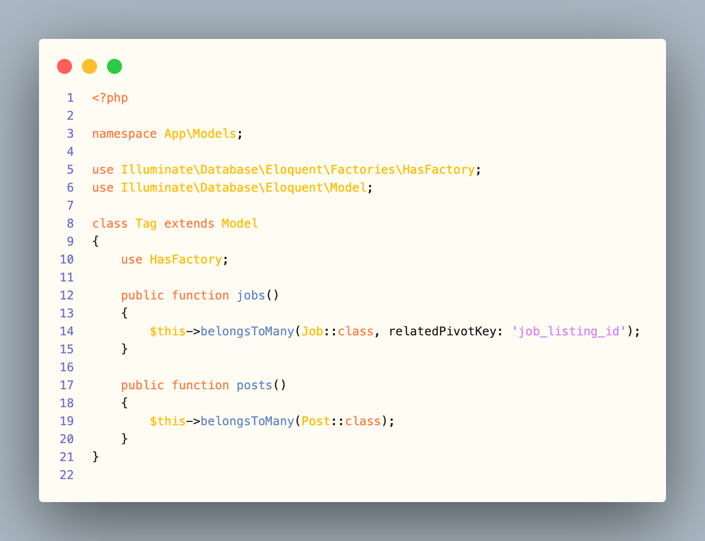
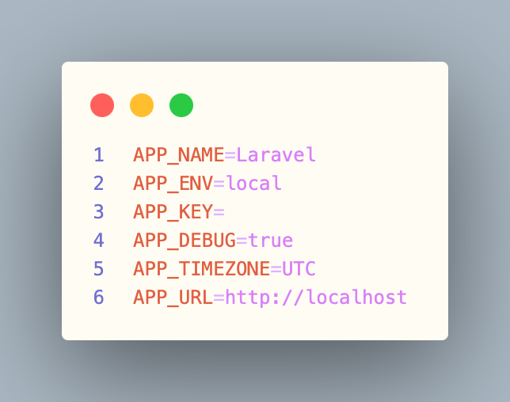
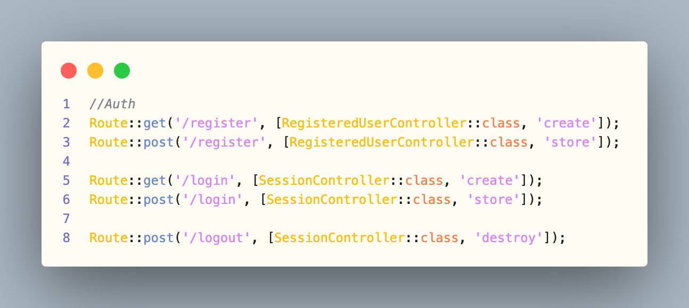
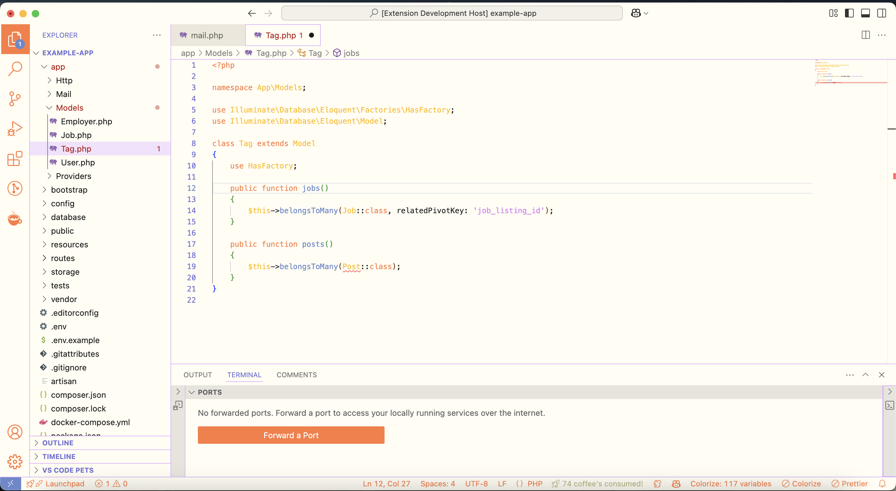

# Welcome to Sunset Serenade color theme

If you are one of those people, who still prefer the light mode over the dark but haven't found **THE ONE** yet... this might be you.

After struggling to find a theme that felt like _"Oh, this is exactly what I need and want!!"_, I chose to make my own, based on my own preferences and wishes, and I am obsessed with the end product.

I hope, I could make some of you out there feel the same, that would make me happy :) 

_I could not figure out how to change the color of the icons in the side bar on hover, help is appreciated._

## Installation
Simply click on the install button and all should be set.
The extension is available for free on [Visual Studio Code Marketplace](https://marketplace.visualstudio.com/manage/publishers/kartoffelente/extensions/sunset-serenade/hub?_a=acquisition).

## Example screenshots

**Enjoy and tell me what you think!**

##### Final words
_This is my first theme, so it is still kind of an experiment._
_However, I want to make this a very good quality one, so constructive feedback, suggestions are appreciated._
_Also, I am aware that sometimes the yellow (or even the pink) is not that visbile, so if there are many complaints about them, I'll change. But for now, I like how it looks :)_